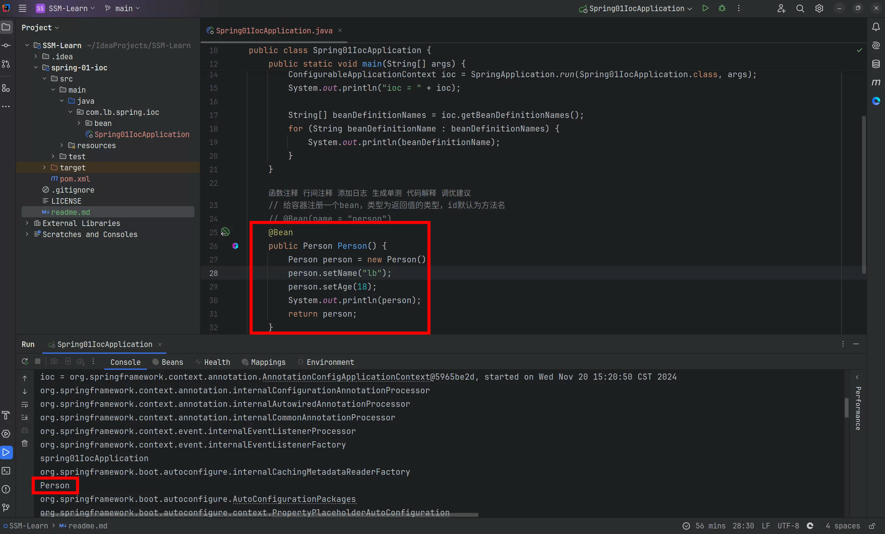

# SSM


## 1.注册组件



### 1.1 **@Bean**
- **作用**：标注在方法上，表示返回的对象由Spring IoC容器管理。
- **特点**：常用于Java配置类（`@Configuration`）中，以定义Bean。
- **默认单例**：创建的Bean默认是单例（Singleton）。
- **示例**：
  ```java
  @Configuration
  public class AppConfig {
      @Bean
      public MyService myService() {
          return new MyService();
      }
  }
  ```
- **注意事项**：需要和`@Configuration`配合使用。

---

### 1.2 **获取Bean**
- **方式**：
  1. **通过`ApplicationContext`**：
     
     ```java
     ApplicationContext context = new AnnotationConfigApplicationContext(AppConfig.class);
     MyService myService = context.getBean(MyService.class);
     ```
  2. **通过`@Autowired`自动注入**：
     ```java
     @Autowired
     private MyService myService;
     ```
- **注意事项**：推荐使用自动注入的方式，减少手动获取。

---

### 1.3 **@Configuration**
- **作用**：标注在类上，表示这是一个配置类，用于定义Bean。
- **特点**：
  - `@Configuration`等价于XML中的`<beans>`。
  - 结合`@Bean`注解用于定义Spring容器的组件。
- **示例**：
  ```java
  @Configuration
  public class AppConfig {
      @Bean
      public MyService myService() {
          return new MyService();
      }
  }
  ```
- **注意事项**：`@Configuration`类会自动启用CGLIB代理，以保证`@Bean`方法只被调用一次。

---

### 1.4 **@Controller**
- **作用**：用于标注控制层组件，主要处理HTTP请求。
- **特点**：
  - 一般结合`@RequestMapping`使用。
  - 用于MVC中的控制器层。
- **示例**：
  ```java
  @Controller
  public class MyController {
      @RequestMapping("/hello")
      public String hello() {
          return "hello";
      }
  }
  ```

---

### 1.5 **@Service**
- **作用**：标注在服务层组件上，用于处理业务逻辑。
- **特点**：属于`@Component`的派生注解，具备`@Component`的功能。
- **示例**：
  ```java
  @Service
  public class MyService {
      public void execute() {
          System.out.println("Executing service logic");
      }
  }
  ```

---

### 1.6 **@Repository**
- **作用**：标注在数据访问层组件上，专注于与数据库的交互。
- **特点**：同样是`@Component`的派生注解，支持异常转换（将数据库异常转换为Spring的DataAccessException）。
- **示例**：
  ```java
  @Repository
  public class MyRepository {
      public List<User> findAll() {
          return new ArrayList<>();
      }
  }
  ```

---

### 1.7 **@Component**
- **作用**：通用的组件注解，用于标注需要Spring容器管理的类。
- **特点**：`@Controller`、`@Service`和`@Repository`都是它的特化版本。
- **示例**：
  ```java
  @Component
  public class MyComponent {
      public void doWork() {
          System.out.println("Working...");
      }
  }
  ```

---

### 1.8 **@ComponentScan**
- **作用**：指定Spring容器扫描的包路径，以发现和注册组件。
- **示例**：
  ```java
  @Configuration
  @ComponentScan(basePackages = "com.example")
  public class AppConfig {}
  ```
- **注意事项**：可以通过`excludeFilters`和`includeFilters`精确控制扫描的范围。

---

### 1.9 **@Import**
- **作用**：用于导入其他配置类或组件。
- **示例**：
  ```java
  @Configuration
  @Import(OtherConfig.class)
  public class AppConfig {}
  ```
- **特点**：
  - 可以加载多个配置类。
  - 支持通过实现`ImportSelector`动态选择导入类。

---

### 1.10 **@Scope**
- **作用**：用于指定Bean的作用域。
- **支持的作用域**：
  - `singleton`（默认）：单例模式。
  - `prototype`：每次获取都会创建新的实例。
  - `request`：每个HTTP请求创建一个实例（Web环境）。
  - `session`：每个会话创建一个实例（Web环境）。
- **示例**：
  ```java
  @Scope("prototype")
  @Component
  public class PrototypeBean {}
  ```

---

### 1.11 **@Lazy**
- **作用**：用于延迟加载Bean。
- **特点**：默认情况下，Spring容器会在启动时初始化所有单例Bean，`@Lazy`可以延迟到第一次使用时才初始化。
- **示例**：
  ```java
  @Lazy
  @Component
  public class LazyBean {}
  ```

---

### 1.12 **FactoryBean**
- **作用**：创建复杂Bean的工厂类。
- **示例**：
  ```java
  public class MyFactoryBean implements FactoryBean<MyService> {
      @Override
      public MyService getObject() {
          return new MyService();
      }
  
      @Override
      public Class<?> getObjectType() {
          return MyService.class;
      }
  }
  ```
- **特点**：`FactoryBean`本身也是一个Bean，通过`getObject()`方法创建目标对象。`FactoryBean`在容器中放的组件的类型，是接口中泛型指定的类型，组件的名字是 工厂自己的名字

---

### 1.13 **@Conditional**
- **作用**：条件化注册Bean，满足特定条件时才注册。
- **特点**：结合`Condition`接口使用，可以根据环境、配置等动态决定是否加载Bean。
- **示例**：
  ```java
  @Conditional(MyCondition.class)
  @Component
  public class ConditionalBean {}
  
  public class MyCondition implements Condition {
      @Override
      public boolean matches(ConditionContext context, AnnotatedTypeMetadata metadata) {
          return context.getEnvironment().containsProperty("my.condition");
      }
  }
  ```
- **注意事项**：需要掌握条件的实现逻辑，适合复杂的应用场景。

## 2. 注入组件

---

### 1. **@Autowired**
- **作用**：用于自动装配Bean，通过类型（byType）注入依赖。
- **特点**：
  - 默认按类型匹配，如果存在多个同类型Bean需要配合`@Qualifier`或`@Primary`。
  - 可用于字段、setter方法或构造方法。
- **示例**：
  ```java
  @Autowired
  private MyService myService;
  ```
- **注意事项**：
  - 如果匹配不到合适的Bean，默认会报错，可以设置`required=false`忽略。
  - 推荐在构造器注入中使用，以确保依赖注入安全性。

---

### 2. **@Qualifier**
- **作用**：在存在多个同类型Bean时，通过指定Bean的名称来注入。
- **示例**：
  ```java
  @Autowired
  @Qualifier("mySpecificService")
  private MyService myService;
  ```
- **注意事项**：必须和`@Autowired`一起使用，明确指向需要的具体Bean。

---

### 3. **@Primary**
- **作用**：在多个同类型Bean中标记优先注入的Bean。
- **示例**：
  ```java
  @Primary
  @Component
  public class PrimaryService implements MyService {}
  ```
- **注意事项**：如果多个Bean都标注了`@Primary`，会引发冲突。

---

### 4. **@Resource**
- **作用**：JDK标准注解，支持按名称（byName）或按类型（byType）注入。
- **特点**：
  - 兼容Spring和非Spring容器。
  - 优先按名称注入，如果名称匹配不到则按类型注入。
- **示例**：
  ```java
  @Resource(name = "myService")
  private MyService myService;
  ```
- **注意事项**：`@Resource`和`@Autowired`功能类似，但语义更明确。

---

### 5. **setter方法注入**
- **作用**：通过setter方法注入依赖。
- **示例**：
  ```java
  private MyService myService;
  
  @Autowired
  public void setMyService(MyService myService) {
      this.myService = myService;
  }
  ```
- **注意事项**：适用于需要动态改变依赖的场景，但不如构造器注入安全。

---

### 6. **构造器注入**
- **作用**：通过构造器注入依赖。
- **示例**：
  ```java
  private final MyService myService;
  
  @Autowired
  public MyComponent(MyService myService) {
      this.myService = myService;
  }
  ```
- **优点**：
  - 依赖声明为`final`，更安全。
  - 强制依赖注入，不会遗漏必需的依赖。
- **推荐**：优先使用构造器注入。

---

### 7. **xxxAware**
- **作用**：让Bean感知Spring容器的特定功能（如`ApplicationContext`或`BeanName`）。
- **常用接口**：
  - `ApplicationContextAware`：获取`ApplicationContext`。
  - `BeanNameAware`：获取Bean的名称。
- **示例**：
  ```java
  public class MyBean implements ApplicationContextAware {
      private ApplicationContext context;
  
      @Override
      public void setApplicationContext(ApplicationContext applicationContext) {
          this.context = applicationContext;
      }
  }
  ```
- **注意事项**：谨慎使用感知接口，可能破坏Bean的可移植性。

---

### 8. **@Value**
- **作用**：从配置文件中注入属性值。
- **示例**：
  ```java
  @Value("${app.name}")
  private String appName;
  ```
- **支持的特性**：
  - 默认值：`${app.name:defaultName}`
  - 复杂SpEL表达式。
- **注意事项**：确保配置文件正确加载。

---

### 9. **SpEL（Spring表达式语言）**
- **作用**：用于在注解或XML中动态计算值。
- **示例**：
  ```java
  @Value("#{1 + 2}")
  private int sum;
  
  @Value("#{myBean.property}")
  private String dynamicValue;
  ```
- **特点**：
  - 支持数学运算、逻辑运算、方法调用等。
  - 灵活强大，但过于复杂时会影响可读性。

---

### 10. **@PropertySource**
- **作用**：加载外部`properties`文件。
- **示例**：
  ```java
  @Configuration
  @PropertySource("classpath:application.properties")
  public class AppConfig {}
  ```
- **注意事项**：可以配合`Environment`或`@Value`读取属性值。

---

### 11. **@Profile**
- **作用**：根据不同环境加载不同的配置。

- **示例**：
  ```java
  @Profile("dev")
  @Component
  public class DevBean {}
  ```
  
- **切换环境**：
  - 通过JVM参数`-Dspring.profiles.active=dev`。
  - 配置文件中设置`spring.profiles.active=dev`。
  
- **注意事项**：推荐使用`@Profile`配合不同的`@Configuration`类进行环境隔离。


## 3.组件生命周期

### **`@Bean`指定生命周期方法**
#### 功能：
- 通过`@Bean`注解定义的Bean，可以指定初始化方法和销毁方法，分别在Bean初始化完成和销毁之前调用。
- 用于细粒度地控制Bean的生命周期。

#### 使用方式：
```java
@Configuration
public class AppConfig {
    @Bean(initMethod = "init", destroyMethod = "cleanup")
    public MyBean myBean() {
        return new MyBean();
    }
}

public class MyBean {
    public void init() {
        System.out.println("Bean初始化方法被调用");
    }

    public void cleanup() {
        System.out.println("Bean销毁方法被调用");
    }
}
```

#### 注意事项：
- 初始化方法和销毁方法需要是**无参的公共方法**。
- 默认销毁方法在非`prototype`作用域下有效。

---

### **实验2：`InitializingBean`接口**
#### 功能：
- 提供一种方式，在Spring容器完成Bean属性设置后执行自定义逻辑。
- `afterPropertiesSet()`方法用于初始化操作。

#### 使用方式：
```java
public class MyBean implements InitializingBean {
    @Override
    public void afterPropertiesSet() throws Exception {
        System.out.println("初始化逻辑通过InitializingBean实现");
    }
}
```

#### 注意事项：
- 与`@Bean`的`initMethod`功能类似，但实现接口会耦合Spring。
- 推荐优先使用注解如`@PostConstruct`，以降低耦合。

---

### **实验3：`DisposableBean`接口**
#### 功能：
- 定义Bean销毁时需要执行的逻辑。
- `destroy()`方法用于释放资源或清理工作。

#### 使用方式：
```java
public class MyBean implements DisposableBean {
    @Override
    public void destroy() throws Exception {
        System.out.println("销毁逻辑通过DisposableBean实现");
    }
}
```

#### 注意事项：
- 类似于`@Bean`的`destroyMethod`，但会导致Spring耦合。
- 推荐使用`@PreDestroy`注解替代。

---

### **实验4：`@PostConstruct`**
#### 功能：
- 在Bean初始化完成并完成依赖注入后调用。
- 等效于`initMethod`或`InitializingBean`，更优雅和标准。

#### 使用方式：
```java
@Component
public class MyBean {
    @PostConstruct
    public void init() {
        System.out.println("通过@PostConstruct执行初始化");
    }
}
```

#### 注意事项：
- 必须引入`javax.annotation`包。
- 不支持在`static`方法上使用。
- 在依赖注入完成后执行，适合配置后初始化操作。

---

### **实验5：`@PreDestroy`**
#### 功能：
- 在Bean被销毁之前调用，通常用于资源清理。
- 等效于`destroyMethod`或`DisposableBean`。

#### 使用方式：
```java
@Component
public class MyBean {
    @PreDestroy
    public void cleanup() {
        System.out.println("通过@PreDestroy执行销毁前逻辑");
    }
}
```

#### 注意事项：
- 同`@PostConstruct`，必须引入`javax.annotation`包。
- 不适用于`prototype`作用域的Bean。

---

### **实验6：`BeanPostProcessor`接口**
#### 功能：
- Spring容器中一个重要的扩展接口，用于对Bean的初始化前后进行拦截和自定义逻辑处理。

#### 方法：
- `postProcessBeforeInitialization(Object bean, String beanName)`：初始化之前调用。
- `postProcessAfterInitialization(Object bean, String beanName)`：初始化之后调用。

#### 使用方式：
```java
@Component
public class MyBeanPostProcessor implements BeanPostProcessor {
    @Override
    public Object postProcessBeforeInitialization(Object bean, String beanName) throws BeansException {
        System.out.println("初始化前拦截：" + beanName);
        return bean;
    }

    @Override
    public Object postProcessAfterInitialization(Object bean, String beanName) throws BeansException {
        System.out.println("初始化后拦截：" + beanName);
        return bean;
    }
}
```

#### 注意事项：
- 用于实现AOP功能，比如动态代理或属性增强。
- 不适合处理单个特定Bean的逻辑，适合全局扩展。

---

### **总结**
| 功能           | 注解/接口              | 推荐程度 |
| -------------- | ---------------------- | -------- |
| **初始化方法** | `@Bean(initMethod)`    | 高       |
|                | `@PostConstruct`       | 高       |
|                | `InitializingBean`     | 中       |
| **销毁方法**   | `@Bean(destroyMethod)` | 高       |
|                | `@PreDestroy`          | 高       |
|                | `DisposableBean`       | 中       |
| **后置处理器** | `BeanPostProcessor`    | 高       |

> **建议**：对于新的项目，优先使用`@PostConstruct`和`@PreDestroy`，它们语义清晰且符合Java标准，避免过多与Spring API耦合。
